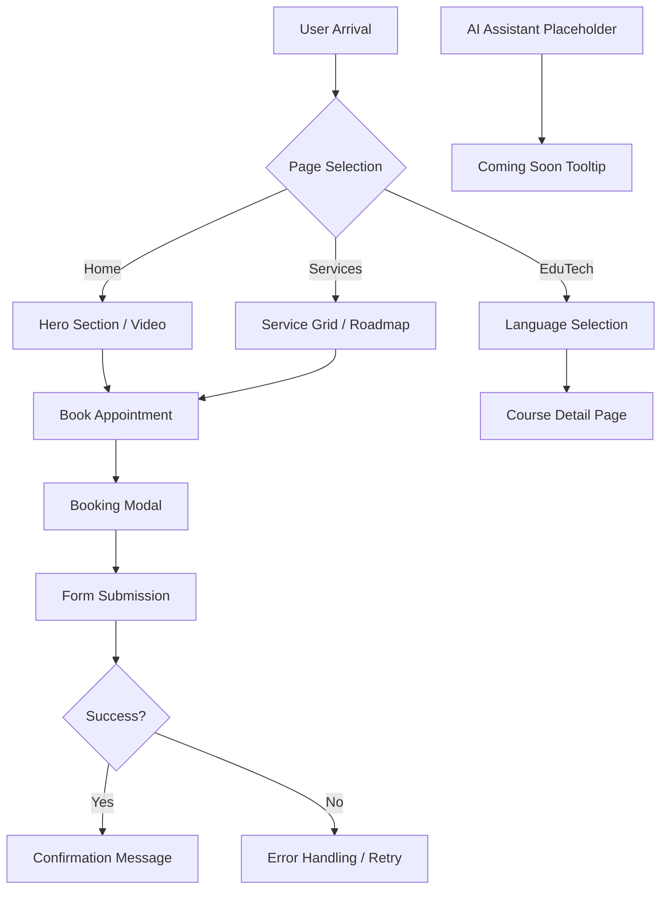

# Arkanj Product Documentation

This documentation is designed to serve clients, stakeholders, and developers simultaneously by providing multi-layered content tailored to different levels of expertise.

---

## 1. High-Level Strategy (For Clients & Executives)
*Focus: The "Why" and the business value.*

### Product Vision & Goals
**Arkanj** is a professional AI-driven automation and software solutions provider. Our "North Star" is to **bridge the gap to an AI-driven future**, making advanced technology simple, accessible, and actionable for small businesses and individuals alike.

### Business Case
In an increasingly digital world, businesses face two main challenges: **Efficiency** and **Skill Gaps**.
*   **Automation:** We help small businesses reclaim time by automating repetitive tasks using smart software solutions.
*   **EduTech:** We empower individuals to stay competitive through AI-powered learning paths in languages and technology.
*   **ROI:** Reduced operational costs through automation and increased human capital value through specialized training.

### Strategic Roadmap
*   **Phase 1 (Current):** Professional web presence, service showcase, and EduTech landing pages.
*   **Phase 2 (Near Future):** 
    *   **AI Chatbot Integration:** Deploying intelligent assistants to handle customer queries and lead generation. (See the floating placeholder in the app).
    *   **Interactive Learning Portal:** Moving from static course descriptions to a full-featured LMS (Learning Management System).
*   **Phase 3 (Long-term):** Deep-tech integrations (MedTech, FinTech specialized modules) and global scaling of the EduTech platform.

*Note: You can view the live Strategic Roadmap at the bottom of the **Services** page.*

### Plain Language Summary
Think of Arkanj as a **"Digital Architect."** Just as an architect designs a house to be functional and modern, we design your digital workflow to be fast and smart. Our EduTech branch is like a **"Personal Tech Coach,"** helping you learn new "languages" (both human and computer) so you can talk to the world and the future.

---

## 2. User-Focused Guidance (For End-Users & Support)
*Focus: Task-oriented instructions and outcomes.*

### How to Book an Appointment
1.  Navigate to the **Home** or **Services** page.
2.  Click the **"Book Appointment"** or **"Start Risk Free"** button.
3.  Fill in your details (Name, Email, Service of interest) in the popup modal.
4.  Our team will reach out to schedule a deep-dive session.

### Exploring EduTech Courses
*   Visit the **EduTech** section from the navigation bar.
*   Browse available languages (German, French, etc.) or Tech Mastery courses.
*   Click on a specific course (e.g., **German Course**) to see detailed curriculum progress and module breakdowns.

### Troubleshooting & FAQs
*   **"I can't see the video on the home page."**
    *   The video is hosted on YouTube. Ensure you have a stable internet connection and haven't blocked YouTube scripts.
*   **"Is the German course available now?"**
    *   The curriculum is currently being finalized. You can view the roadmap on the German Course page.

---

## 3. Technical Specifications (For Developers & Engineers)
*Focus: Precise, actionable "How" documentation.*

### System Architecture
The application is built as a **Modern React Single Page Application (SPA)** using **Vite** for high-performance development and bundling.

*   **Frontend Framework:** React 19
*   **Styling:** Tailwind CSS 4.0 (Utility-first CSS)
*   **Animations:** Motion (formerly Framer Motion)
*   **Routing:** React Router 7
*   **Icons:** Lucide React

### Directory Structure
*   `/src/pages`: Contains top-level route components (Home, Services, EduTech, etc.).
*   `/src/components`: Reusable UI elements (Navbar, Footer, Modals).
*   `/src/lib`: Utility functions (e.g., `cn` for Tailwind class merging).
*   `/src/types.ts`: Centralized TypeScript interfaces and enums.

### Key Technical Decisions (ADRs)
*   **ADR 1: Vite over CRA:** Chosen for significantly faster build times and better HMR (Hot Module Replacement) support.
*   **ADR 2: Tailwind CSS:** Selected to ensure a highly customizable and consistent design system without the overhead of large CSS files.
*   **ADR 3: Lazy Loading:** All major pages are lazy-loaded using `React.lazy` and `Suspense` to minimize the initial bundle size and improve PageSpeed scores.

### Future Technical Integrations
*   **Gemini AI Integration:** We plan to use `@google/genai` to power the upcoming AI Chatbots. Developers should refer to the `src/services/geminiService.ts` (to be created) for implementation details.
*   **Backend Migration:** While currently a frontend-only app, future iterations requiring user accounts will migrate to a full-stack Express + Vite setup or integrate with Firebase for real-time data.

---

---

## 4. Product Requirements Document (PRD) & Methodology
*Focus: The "What" and "How" for the entire team.*

### What is this PRD?
This section outlines the product's purpose, features, functions, and behaviors. It serves as the definitive source of truth for requirements.

### Why do we use it?
*   **Clear Guidance:** Provides a roadmap for development.
*   **Alignment:** Ensures everyone (Devs, UX, Stakeholders) is on the same page.
*   **Source of Truth:** Prevents "scope creep" and misunderstandings.

### Who is this for?
*   **Developers:** To know exactly what to build.
*   **UX/UI Designers:** To align visuals with functional needs.
*   **Stakeholders:** To verify business goals are met.
*   **QA/Analytics:** To define test cases and tracking metrics.

### When is it updated?
*   During new feature requests.
*   After strategy and customer benefits are determined.
*   **Before** development begins.

### Objective, Assumptions & Dependencies
*   **Objective:** To provide a seamless, AI-driven experience for users seeking automation services and educational content.
*   **Assumptions:**
    *   Users have basic internet literacy.
    *   The primary audience is small business owners and lifelong learners.
    *   The platform will be accessed primarily via modern web browsers (Chrome, Safari, Edge).
*   **Dependencies:**
    *   **External APIs:** YouTube API for video hosting, Gemini API for future chatbot features.
    *   **Hosting:** Cloud Run for containerized deployment.
    *   **Frameworks:** React, Tailwind CSS, and Motion for UI/UX.

### Methodology (How we work)
1.  **Review:** The team reads the PRD independently.
2.  **Feedback:** Space is provided at the end of each section for notes and questions.
3.  **Alignment:** High-level feedback is reviewed and inline questions are resolved.
4.  **Finalization:** The doc is finalized before coding starts.
5.  **Iteration:** Updated with new learnings after development begins.

---

### Functional Requirements
*How the user interacts with the product and what the system must do.*

| Who | Action (What/How) | Response (When) |
| :--- | :--- | :--- |
| **End User** | Clicks "Book Appointment" | System opens a modal with a contact form immediately. |
| **End User** | Navigates to /edutech/german | System loads the German course curriculum with progress bars. |
| **End User** | Submits an empty form | System displays a validation error message below the field. |
| **System** | Detects mobile device | System adjusts the layout to a single-column responsive view. |

### Non-Functional Requirements
*Product properties and user expectations (Performance, Security, Reliability).*

*   **Performance:** The home page must load in under 2 seconds on a 4G connection.
*   **Availability:** The site should have 99.9% uptime.
*   **Responsiveness:** All interactive elements (buttons, links) must provide visual feedback within 100ms of a click.
*   **Timeout:** Form submissions will timeout after 30 seconds if the server is unresponsive.

### Metrics (KPIs)
*How we measure success.*

*   **Conversion Rate:** Percentage of visitors who click "Book Appointment."
*   **Engagement:** Average time spent on the EduTech landing pages.
*   **Retention:** Number of returning users visiting the German Course page.
*   **Error Rate:** Frequency of 404 "Not Found" hits (tracked via analytics).

---

### Functional Diagram (System Flow)

---

### Key Takeaways
*   **The Compass:** The PRD is the source of truth across the entire team.
*   **Review Early:** Catching gaps early saves significant development time.
*   **User-Centric:** All requirements are written from the end-user's perspective.
*   **Comprehensive:** Covers both what the product *does* (features) and how it *feels* (properties).

---

## Glossary of Terms
*   **EduTech:** Education Technology; the use of software/hardware to enhance learning.
*   **SPA:** Single Page Application; a website that interacts with the user by dynamically rewriting the current page rather than loading entire new pages from a server.
*   **HMR:** Hot Module Replacement; a feature that updates modules in a running application without a full refresh.
*   **LMS:** Learning Management System; a software application for the administration, documentation, tracking, and delivery of educational courses.

---

## 5. Task History & Changelog
*Record of completed tasks and project milestones.*

### April 3, 2026
*   **Project Kickoff:** Initialized React + Vite project with TypeScript.
*   **Infrastructure Setup:** Configured Tailwind CSS 4.0 and established the global design system (colors, typography).
*   **Base Routing:** Set up `react-router-dom` and defined the initial application structure.

### April 4, 2026
*   **Core Layout:** Developed the `Navbar` and `Footer` components with responsive navigation.
*   **Home Page Foundation:** Created the hero section with the "Smart Automation. Simple AI." value proposition.

### April 5, 2026
*   **Services Architecture:** Defined the `SERVICES` data model and created the initial `Services` page grid.
*   **Iconography:** Integrated `lucide-react` and created custom tech icons for brand consistency.

### April 6, 2026
*   **Lead Generation:** Developed the `BookingModal` component for appointment scheduling.
*   **Contact Page:** Implemented the `Contact` page with a functional layout and location integration.

### April 7, 2026
*   **Brand Story:** Developed the `About` page, focusing on the mission and "Digital Architect" concept.
*   **Visual Identity:** Refined the `mesh-gradient` and `grid-pattern` background styles.

### April 8, 2026
*   **EduTech Expansion:** Launched the `EduTechLanding` page to showcase language and tech mastery courses.
*   **Course Logic:** Implemented the language selection grid with progress indicators.

### April 9, 2026
*   **Deep-Dive Content:** Created the `GermanCourse` page with a detailed curriculum roadmap and module breakdowns.
*   **Navigation Logic:** Implemented `ScrollToTop` and hash-link navigation for better UX.

### April 10, 2026
*   **Animation Pass:** Integrated `motion` (Framer Motion) for smooth page transitions and scroll-reveal effects.
*   **Performance:** Implemented `React.lazy` and `Suspense` for all major page routes.

### April 11, 2026
*   **Social Proof:** Added the Testimonials section and "Our Customers" logo grid to the Home page.
*   **Portfolio Showcase:** Developed the Portfolio grid with hover effects and project categories.

### April 13, 2026
*   **Mobile Optimization:** Conducted a full responsive design audit, ensuring touch targets and layouts are mobile-friendly.
*   **SEO & Accessibility:** Optimized `metadata.json` and added `referrerPolicy` to all external images.

### April 14, 2026 (Today)
*   **Documentation Initialization:** Created `DOCUMENTATION.md` following a multi-layered approach (Strategy, User Guidance, Technical Specs).
*   **PRD Integration:** Expanded documentation with a full Product Requirements Document (PRD) including Functional/Non-Functional requirements, Methodology, and Metrics.
*   **Functional Mapping:** Created a Mermaid system flow diagram to visualize the user journey and system architecture.
*   **UI Enhancement (Roadmap):** Implemented a live "Strategic Roadmap" section on the Services page to align stakeholders with future goals.
*   **Feature Prototyping:** Added a floating AI Assistant placeholder in `App.tsx` to demonstrate the upcoming Phase 2 AI integration.
*   **Metadata Optimization:** Updated project metadata to accurately reflect the professional AI-driven nature of the Arkanj platform.
